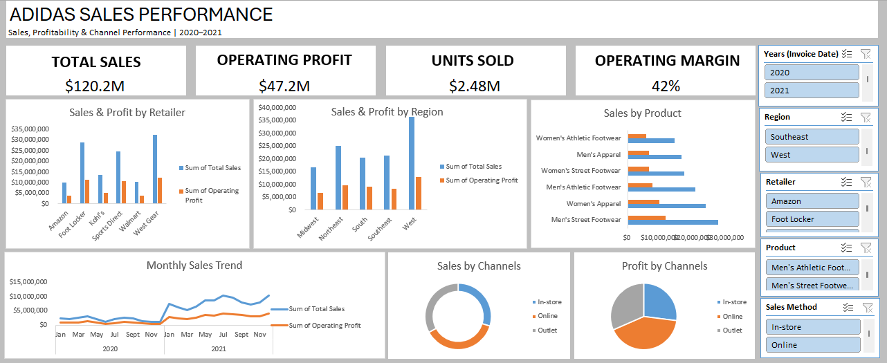

# Adidas-Sales-Analysis
Excel-based sales performance analysis of Adidas data, covering products, regions, retailers, sales channels, trends, dashboard development, and business recommendations.
# Adidas Sales Performance Analysis

## Project Overview

This project is an Excel-based analysis of Adidas sales data completed as part of a Data Analytics Capstone Project.

The analysis focuses on understanding sales and profitability across products, regions, retailers, sales methods, and time. The goal was not only to identify the major drivers of performance, but also to uncover patterns in the data and translate them into practical business recommendations.

The project involved data validation, exploratory analysis, PivotTable analysis, dashboard development, interpretation of findings, and presentation of business recommendations.

---

## Business Problem

Adidas operates across multiple retail partners and sales channels, including in-store, online, and outlet sales. The purpose of this analysis was to better understand the available sales data and answer questions that could support product, regional, channel, and retailer decisions.

The analysis focused on questions such as:

- Which Adidas product categories generate the highest sales?
- Which regions and locations consistently deliver the strongest performance?
- How do sales trends vary across months and quarters?
- Which retailers contribute the most to sales and profitability?
- Which sales methods generate the most revenue?
- Which products show strong performance or potential across different markets?
- Which product lines perform best across different regions?

---

## Dataset

The dataset contains **9,648 sales records** covering the period from **January 2020 to December 2021**.

The main variables used in the analysis include:

- Retailer
- Invoice Date
- Region
- State
- City
- Product
- Price per Unit
- Units Sold
- Total Sales
- Operating Profit
- Operating Margin
- Sales Method

---

## Tools Used

- **Microsoft Excel**
- **PivotTables**
- **PivotCharts**
- **Slicers**
- **Excel formulas**
- **Data Cleaning and Validation**
- **Dashboard Design**
- **Business Analysis**

---

## Data Preparation

Before carrying out the analysis, the dataset was reviewed and validated to ensure that the values used for the analysis were accurate.

An issue was identified in the original Total Sales values. Total Sales was therefore recalculated using:

**Total Sales = Units Sold × Price per Unit**

The corrected sales values were then used throughout the analysis.

The data was subsequently organised and analysed using Excel PivotTables across different dimensions, including product, region, retailer, sales method, month, quarter, and year.

---

## Analysis Performed

The project involved analysing:

- Overall sales and profitability performance
- Product and product-category performance
- Regional and state performance
- Monthly and quarterly sales trends
- Retailer performance
- Sales-method performance
- Product performance across regions
- Sales-method performance across regions
- Product performance over time

---

## Dashboard

An interactive Excel dashboard was developed to summarise the major KPIs and make the results easier to explore.

The dashboard includes:

- Total Sales
- Operating Profit
- Units Sold
- Operating Margin
- Sales and Profit by Retailer
- Sales and Profit by Region
- Sales by Product
- Monthly Sales Trend
- Sales by Channel
- Profit by Channel
- Interactive slicers for Year, Region, Retailer, Product, and Sales Method

---

## Key Findings

The analysis produced several key insights:

- **Men's Street Footwear** was the highest-performing individual product line.
- **Footwear** generated the majority of total sales compared with apparel.
- The **West** was the strongest region overall and showed strong performance across multiple product lines.
- **West Gear** was the leading retailer overall across sales, profit, and units sold, although retailer leadership changed when performance was examined by year and region.
- **Online** generated the highest overall sales, operating profit, and units sold among the three sales methods.
- **Q3** recorded the strongest overall quarterly sales performance.
- Men's Street Footwear was the leading product line in **four of the five regions**, while Women's Apparel led in the South.
- Channel performance varied geographically, showing that the strongest sales method overall was not necessarily the strongest method in every region.

---

## Business Recommendations

Based on the analysis, the following recommendations were developed:

- Prioritise strong-performing products such as Men's Street Footwear while maintaining a diversified product portfolio.
- Apply region-specific product strategies rather than using the same product mix across every market.
- Continue strengthening the Online channel while accounting for regional differences in channel performance.
- Prepare inventory and marketing activities ahead of strong sales periods, particularly Q3.
- Manage retailer partnerships using both overall performance and regional performance.
- Investigate underperforming region-channel combinations to identify opportunities for improvement.
- Use profitability alongside sales revenue when evaluating products, retailers, and channels.
- Extend future analysis with additional years of data and variables such as promotions, discounts, inventory, and marketing activity.

---

## Project Files

The repository contains:

- **`Adidas_Sales_Analysis.xlsx`** – Excel workbook containing the analysis, PivotTables, and dashboard.
- **`dashboard/`** – Dashboard image for quick viewing.
- **`report/`** – Detailed findings and business recommendations report.

---

## Skills Demonstrated

This project demonstrates practical experience in:

- Data cleaning and validation
- Excel data analysis
- PivotTable and PivotChart development
- KPI analysis
- Dashboard development
- Trend analysis
- Multidimensional business analysis
- Data visualisation
- Business insight generation
- Data-driven recommendation development

---

## Project Note

This project was completed as part of a collaborative Data Analytics Capstone Project. The analysis and dashboard presented in this repository reflect the work and analytical skills developed during the project.

---

## Author

**Olasubomi Olonade**

Statistics Graduate | Aspiring Data Analyst

[LinkedIn](https://www.linkedin.com/in/olasubomi-olonade-9a30932a8/) | [GitHub](https://github.com/Olasubomi301)
